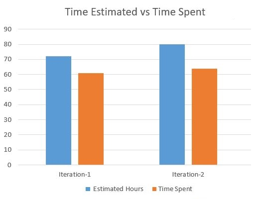

#As a team, complete a retrospective activity based on your work from the previous iteration: discuss a part of your project that has not been as successful as you would have liked, and how it can be improved in this iteration (do this early!). Determine concrete (and realistic) ways of improvement, and decide how its success will be evaluated at the end of the iteration (measurable and objective). Also include a chart (as an image) showing the 2 data points of project velocity from the last two iterations.

Throughout the project, we all agreed upon that we were able to successfully release a deliverable application with having at least a minimal amount of feature we have to provide for an iteration.

In iteration 2 we always hold our meeting randomly, which is to schedule the meeting based on everyone's free time. The disadvantage of it is that we cannot control the pace of our project. Someone might complete most of his work while others are still at the start, which is not good for cooperation.
After the first iteration, we figured out that, in the private group server, there was less interaction and communication happen in iteration 1. In consequence, we had difficulties understanding what new has been added to our project, what is the proportion of a feature that has been completed based on that addition, and how far we must work to complete the feature.
So, we did work on that part in iteration 2. We had better communication in iteration-2 in private group server, gather and all other ways we can communicate with our team members. But, that was not enough to make a big change from iteration 2. Which led us to find a new bug just before the due date for iteration 2 and the amount of time we had in our hand was not enough to resolve the bug.
During the retrospective group session after iteration 2, we did talk about our own effort towards the previous iteration. For instance, how much effort we have done, what was our own imperfection that led toward bugs before the due date, and what we should follow in our final iteration.
Thus, in this iteration, we decide to have a regular meeting hold at each Wednesday 4 pm and for meeting we have set some tasks for individuals. Everybody must finish the assigned work before our meeting. We divide the whole iteration into several small due dates so that everybody keeps the same pace and any error or bug can be pointed out and get fixed right away. We encouraged everyone to test the application after the addition of a new feature or at least before the weekly meeting. That helped us to find out a bug, issues in our current updated project. That also helps to bring valuable improvements to our application.

